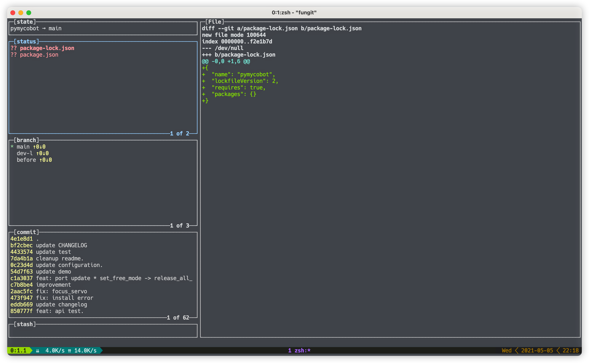

A terminal tool with GUI, help you use git more simple.

Just support Linux, MacOs or other UNIX-like, and Python version is **3.7** or above.

You can use Pipy install it.

```shell
pip3 install fungit --user
```

It support gui and command ways.

You can use `fungit` to open a gui in terminal, like:



Also you can use it with `g` , like this:

```
[fungit] version: 2.1.2
git version 2.30.1 (Apple Git-130)

Description:
Fungit terminal tool, help you use git more simple. Support Linux and MacOS.

You can use -h and --help to get how to use command fungit.
```

>The idea came from `lazygit`.
